# Lopez Creative Services — Microsoft 365 / Entra ID Help Desk Support Lab

## Project Overview

This project simulates Microsoft 365 and Microsoft Entra ID help desk administration for a mock small business called **Lopez Creative Services**.

The lab focuses on cloud-based user support tasks commonly performed by entry-level Help Desk, IT Support, Service Desk, Desktop Support, Technical Support, and remote IT support roles.

This lab was built as a **cloud-only Microsoft 365 / Entra ID environment**. It conceptually follows a previous Active Directory home lab but does not use hybrid identity, Entra Connect, or on-premises directory synchronization.

## Related Project

This lab builds conceptually from my previous project:

**Lopez Creative Services — Active Directory Home Lab**

The Active Directory lab focused on on-premises identity and access management using Windows Server, Active Directory, Group Policy, file shares, NTFS permissions, onboarding/offboarding, service account restrictions, and workstation local admin control.

This Microsoft 365 / Entra ID lab focuses on the cloud administration side of help desk support.

## Mock Company

**Company:** Lopez Creative Services

**Departments:**

- HR
- Finance
- Sales
- IT
- Operations
- Contractors
- Admins

## Lab Goals

The goal of this lab was to practice and document practical Microsoft 365 help desk workflows, including:

- Microsoft 365 admin center navigation
- Microsoft Entra admin center navigation
- Cloud user account creation
- Bulk user import using CSV
- Microsoft 365 license assignment
- Security group creation and membership management
- Security Defaults / MFA baseline review
- Password reset workflow
- Contractor offboarding workflow
- Teams admin center access
- SharePoint admin center access
- Exchange admin center mailbox review
- Microsoft 365 service health review
- New employee onboarding verification

## Tools Used

- Microsoft 365 admin center
- Microsoft Entra admin center
- Microsoft Teams admin center
- SharePoint admin center
- Exchange admin center
- Microsoft 365 Service Health
- CSV bulk user import
- Windows screenshot tools

## Skills Demonstrated

- Created and managed Microsoft 365 cloud user accounts
- Assigned Microsoft 365 Business Premium licenses
- Created department-based security groups
- Added users to security groups based on department or role
- Reviewed Microsoft Entra Security Defaults for MFA/security baseline
- Performed a password reset workflow with required password change at next sign-in
- Blocked sign-in for a contractor offboarding scenario
- Removed a Microsoft 365 license from an offboarded contractor account
- Removed contractor group access
- Reviewed Teams, SharePoint, Exchange, and Service Health admin centers
- Documented Microsoft 365 administrative tasks for portfolio use

---

# Lab Walkthrough

## 1. Microsoft 365 Admin Center Access

The lab began by confirming access to the Microsoft 365 admin center for the Lopez Creative Services tenant.

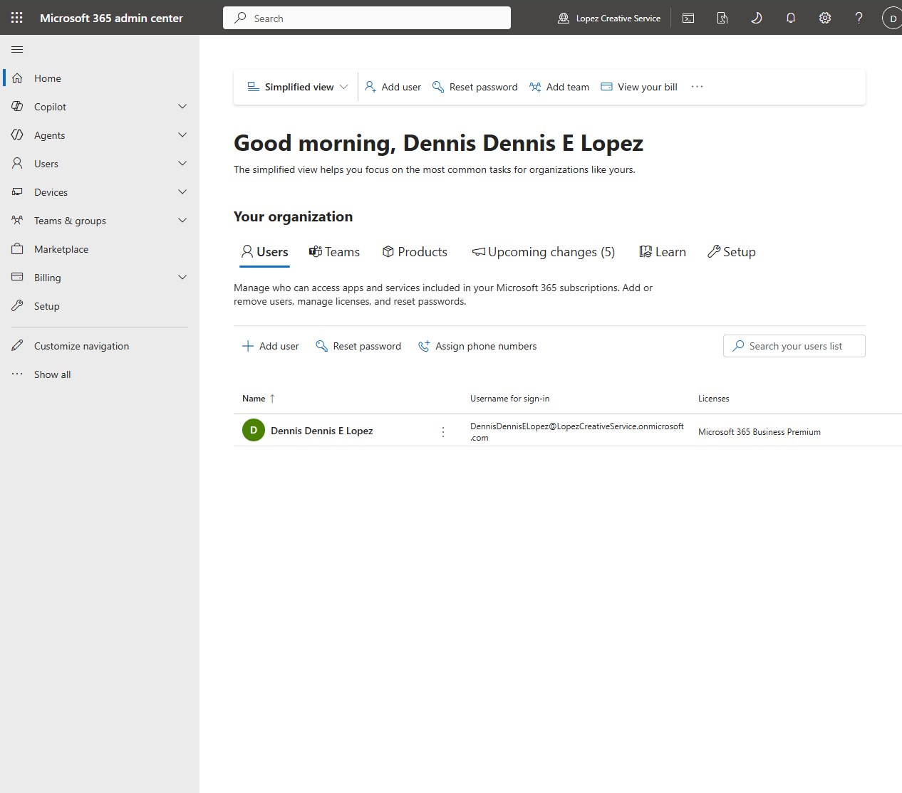

---

## 2. Microsoft Entra Admin Center Access

The Microsoft Entra admin center was used to review tenant identity settings, users, groups, roles, authentication methods, and security-related configuration.

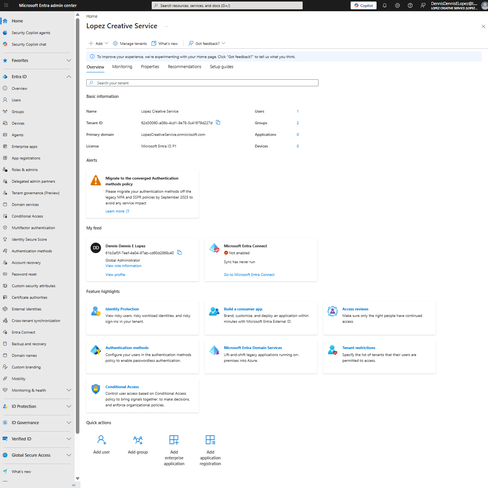

---

## 3. User Account Management

Before creating test users, the Entra users list was reviewed to establish a baseline.

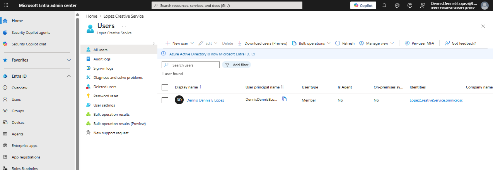

Multiple cloud users were then created using Microsoft 365 bulk user import.

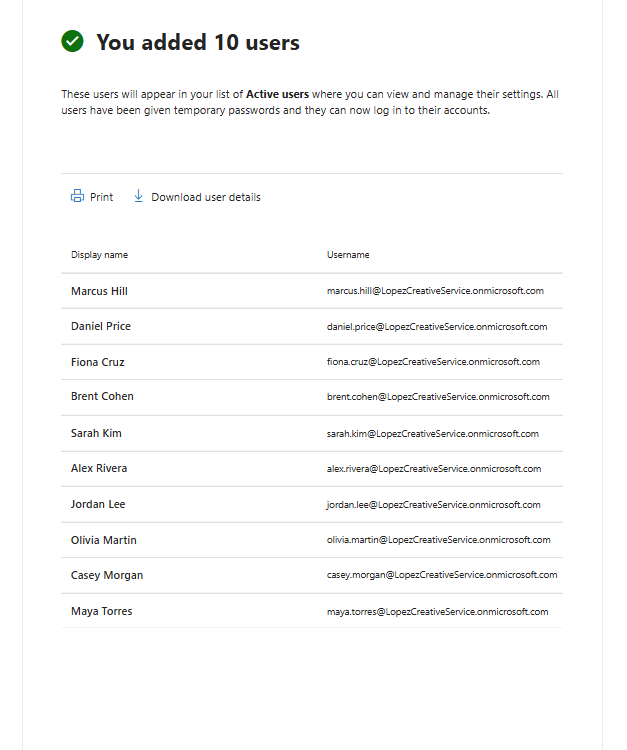

The completed active users list shows the mock Lopez Creative Services users with Microsoft 365 licensing assigned.

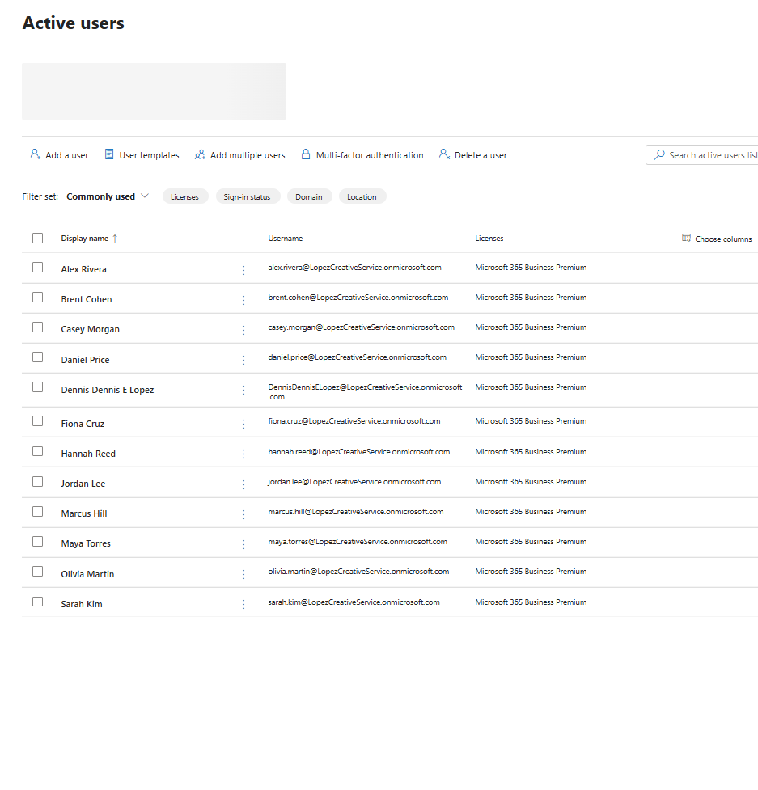

---

## 4. Security Group Management

Department-based security groups were created for HR, Finance, Sales, IT, Operations, Contractors, and Admins.

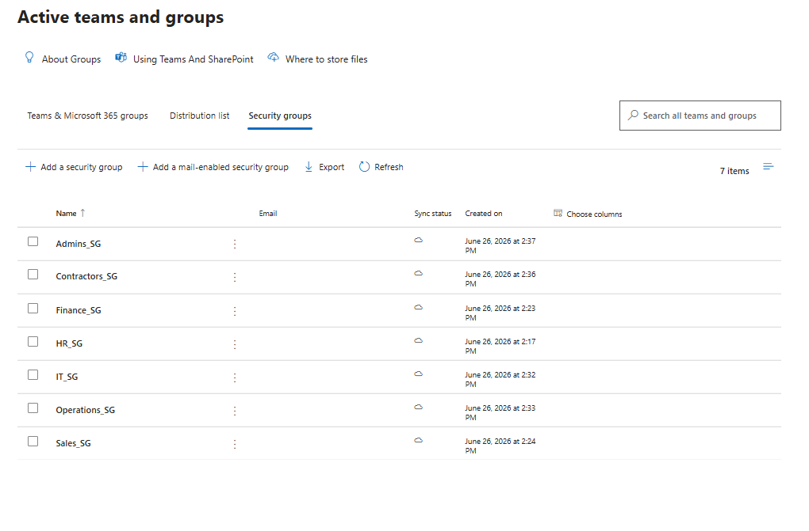

These groups support access organization and common help desk workflows such as onboarding, offboarding, and department-based access requests.

---

## 5. MFA and Security Defaults

Microsoft Entra Security Defaults were reviewed to confirm the tenant’s baseline security configuration.

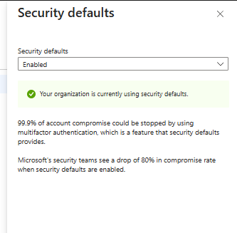

This establishes the lab’s MFA/security baseline and supports common help desk scenarios involving authentication prompts, sign-in protection, and MFA troubleshooting.

---

## 6. Password Reset Workflow

A password reset workflow was performed for Hannah Reed using the Microsoft 365 admin center. The reset was configured to automatically create a password and require the user to change it at first sign-in.

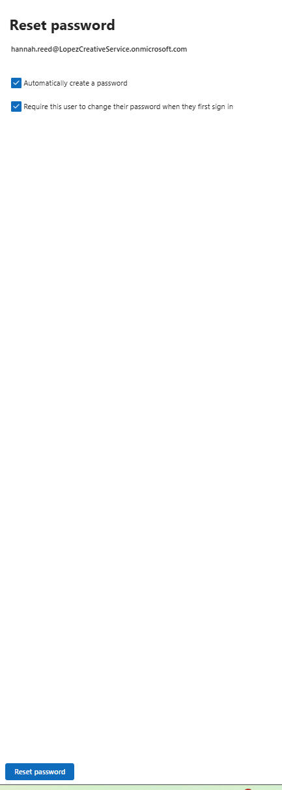

This demonstrates a common Tier 1 help desk task for account recovery and user access support.

---

## 7. Contractor Offboarding Workflow

A contractor offboarding scenario was performed for Casey Morgan. The account was blocked from signing in, the Microsoft 365 license was removed, and contractor group access was cleaned up.

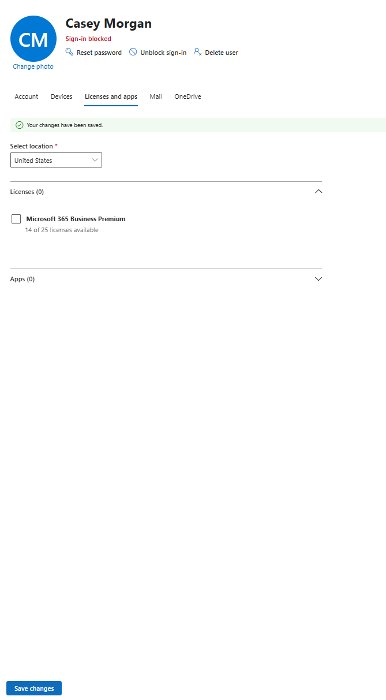

This demonstrates a realistic access-removal workflow without immediately deleting the account.

---

## 8. Microsoft Teams Admin Center

The Teams admin center was reviewed to understand where administrators can begin troubleshooting Teams access, meetings, devices, activity, and sign-in issues.

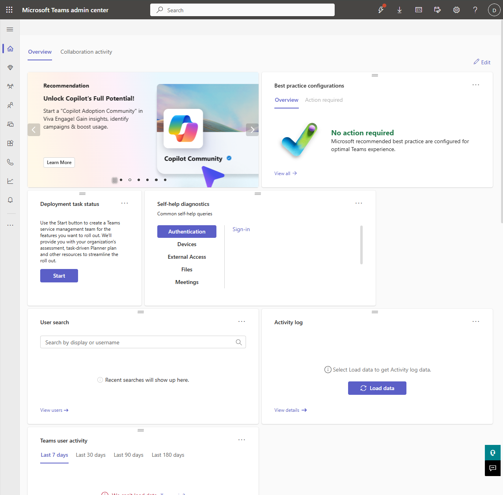

---

## 9. SharePoint Admin Center

The SharePoint admin center was reviewed to understand where administrators can manage sites, OneDrive-related settings, policies, reports, and file access support.

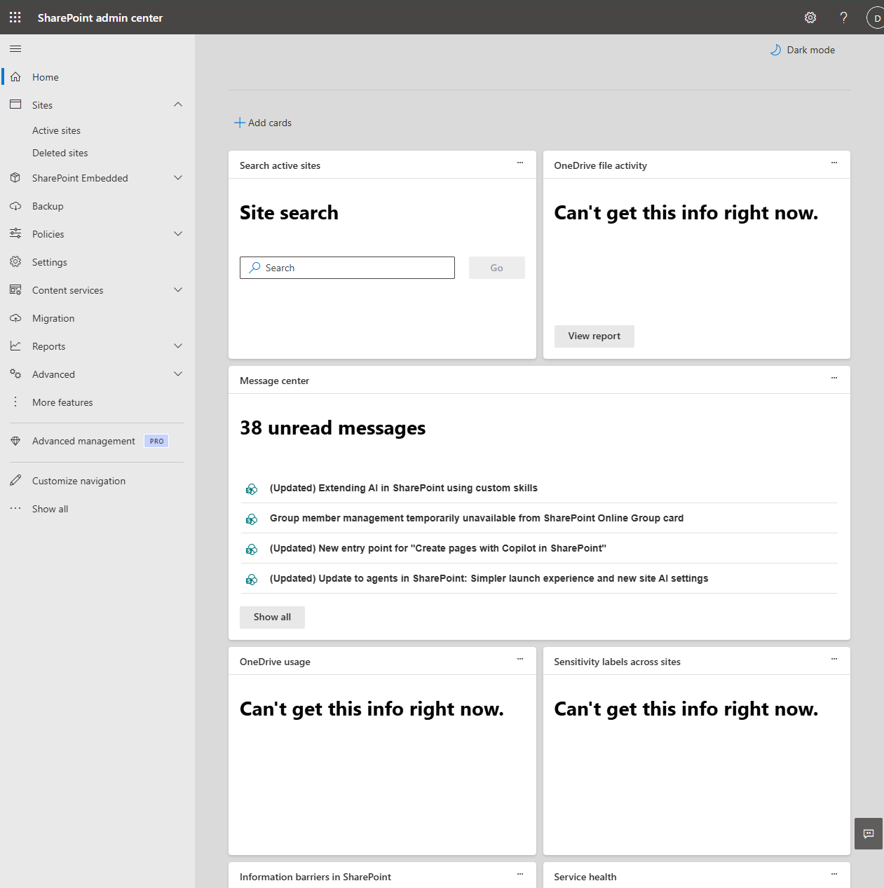

---

## 10. Exchange Admin Center

The Exchange admin center mailbox list was reviewed to understand where administrators can begin troubleshooting mailbox and Outlook-related support issues.

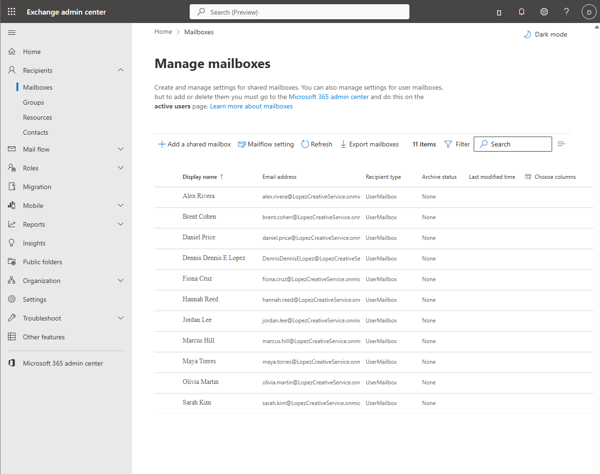

---

## 11. Microsoft 365 Service Health

The Microsoft 365 Service Health dashboard was reviewed to check active advisories and cloud service status.

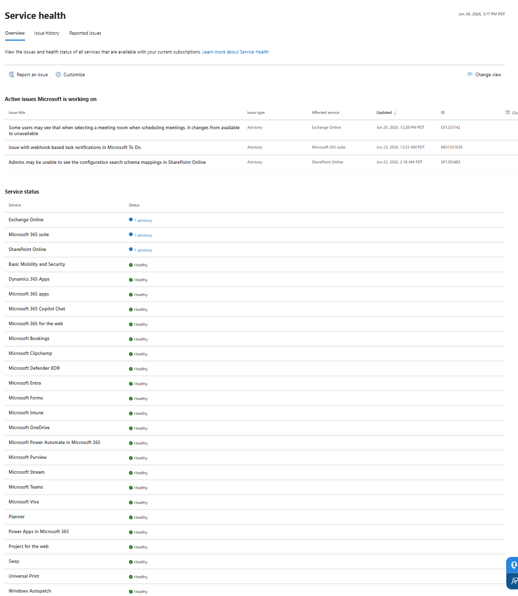

This demonstrates a help desk troubleshooting step for checking whether user-reported issues may be related to Microsoft service incidents or advisories.

---

## 12. Onboarding Verification

Maya Torres was used as an onboarding test user. Her account was reviewed to confirm group membership, no administrator access, and account management options.

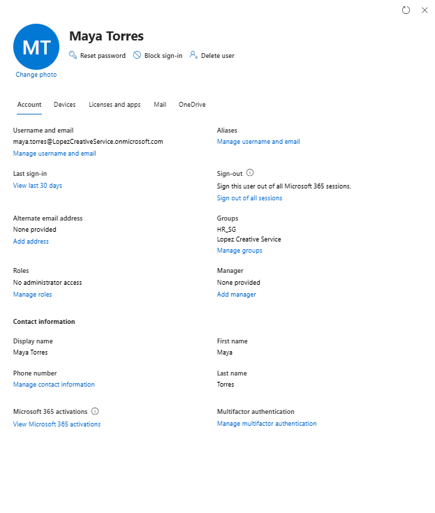

Her Microsoft 365 Business Premium license was also verified.

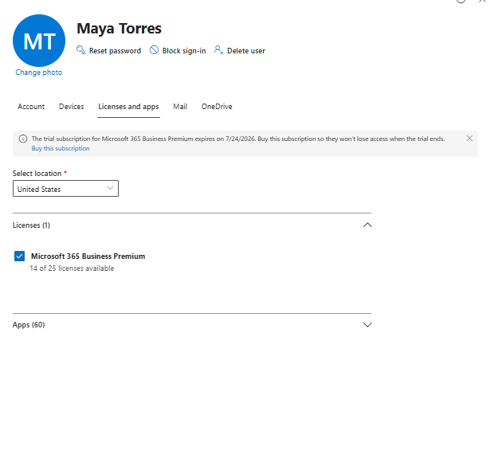

---

# Help Desk Scenarios Practiced

## New Employee Onboarding

Reviewed a new HR user account, confirmed group membership, verified license assignment, and checked account management options.

## Bulk Account Provisioning

Used Microsoft 365 bulk user import to create multiple cloud users for different departments.

## License Assignment

Assigned and verified Microsoft 365 Business Premium licensing for users.

## Department Group Management

Created department-based security groups for HR, Finance, Sales, IT, Operations, Contractors, and Admins.

## MFA and Security Baseline Review

Reviewed Microsoft Entra Security Defaults and Microsoft 365 MFA configuration guidance.

## Password Reset Support

Performed a password reset workflow for a test user with automatic password generation and required password change at first sign-in.

## Contractor Offboarding

Blocked sign-in, removed Microsoft 365 licensing, and removed contractor group membership for a contractor account.

## Microsoft 365 Service Support

Reviewed Teams, SharePoint, Exchange, and Service Health admin centers to understand where common support tasks begin.

---

# Final Outcome

This lab demonstrates practical Microsoft 365 and Microsoft Entra ID help desk support skills using a realistic small-business cloud environment.

The project shows the ability to manage users, licenses, groups, authentication settings, service portals, and common account support workflows. It also demonstrates documentation skills through organized screenshots and a structured project walkthrough.
